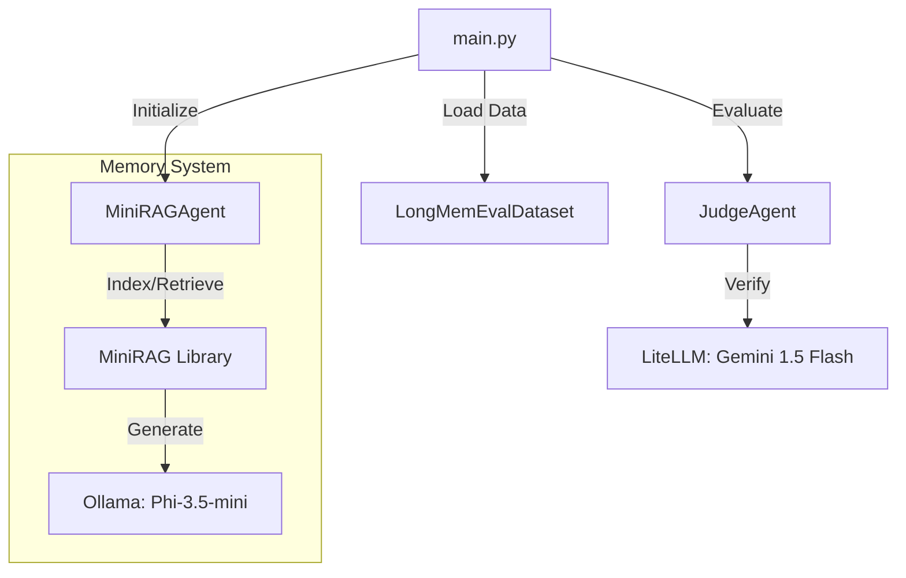

# Investigathon NLP - MiniRAG Integration
# Brownfield Enhancement Architecture

## Introduction

This document outlines the architectural approach for enhancing **Investigathon NLP** with **MiniRAG Integration**. Its primary goal is to serve as the guiding architectural blueprint for AI-driven development of new features while ensuring seamless integration with the existing system.

**Relationship to Existing Architecture:**
This document supplements existing project architecture by defining how the new `MiniRAGAgent` will integrate with the current `main.py` pipeline and `RAGAgent` interfaces.

### Existing Project Analysis
- **Primary Purpose**: Evaluate memory systems for conversational agents using small LLMs.
- **Current Tech Stack**: Python, LiteLLM, Ollama, RAG (Baseline).
- **Architecture Style**: Modular Agent-based pipeline (Pipeline -> Agent -> Model).
- **Deployment Method**: Local execution via `uv` or `python`.

**Identified Constraints**:
- **Model Size**: Must use models <4B parameters (Phi-3.5-mini-instruct).
- **Judge**: Gemini 1.5 Flash for evaluation.
- **Data Separation**: `data/longmemeval` for optimization, `data/investigathon` for held-out evaluation.

## Enhancement Scope and Integration Strategy

**Enhancement Type**: New Feature / Module Replacement
**Scope**: Add `MiniRAG` as a superior memory module replacing/augmenting the baseline RAG.
**Integration Impact**: Medium. Requires new dependencies and a new Agent adapter, but preserves the `main.py` driver logic.

### Integration Approach
- **Code Integration**: Create `src/agents/MiniRAGAgent.py` implementing the same interface as `RAGAgent` (specifically `answer(instance)`).
- **Dependency Management**: Clone `MiniRAG` into `src/MiniRAG`. Add requirements to `pyproject.toml` if possible, or manages via `uv`.

## Tech Stack

### Existing Technology Stack
| Category | Current Technology | Version | Usage in Enhancement | Notes |
| :--- | :--- | :--- | :--- | :--- |
| **Language** | Python | 3.10+ | Core | |
| **LLM Client** | LiteLLM | Latest | Interface to Ollama/OpenAI | |
| **Model Server** | Ollama | Latest | Hosting Phi-3.5-mini | |
| **Orchestration** | Custom (main.py) | N/A | Evaluation Runner | |

### New Technology Additions
| Technology | Version | Purpose | Rationale | Integration Method |
| :--- | :--- | :--- | :--- | :--- |
| **MiniRAG** | git-main | Retrieval/Memory | Core research objective | Submodule/Source in `src/MiniRAG` |
| **Phi-3.5-mini** | 3.8B | Generation Model | <4B Constraint | Via Ollama |
| **all-MiniLM-L6-v2** | Latest | Embedding Model | Optimize Retrieval | Configured in MiniRAG |

## Component Architecture

### New Components

#### `MiniRAGAgent`
**Responsibility**: adapter class that translates `LongMemEvalInstance` data into `MiniRAG`'s expected input, triggers indexing/retrieval, and returns the answer.
**Integration Points**:
- `src/agents/MiniRAGAgent.py`: New file.
- `main.py`: Import and instantiation logic.

**Key Interfaces**:
- `answer(instance: LongMemEvalInstance) -> str`: Main entry point called by `main.py`.

**Dependencies**:
- **Existing**: `LongMemEvalInstance` (Data Class), `LiteLLM` (if MiniRAG needs external calls or we wrap it).
- **New**: `MiniRAG` library code.

**Technology Stack**: Python, MiniRAG.

### Component Interaction Diagram



## Source Tree

### New File Organization
```
investigaton-NLP/
├── src/
│   ├── MiniRAG/                # [NEW] Cloned MiniRAG repository
│   ├── agents/
│   │   ├── MiniRAGAgent.py     # [NEW] Adapter class
│   │   ├── RAGAgent.py         # [EXISTING] Baseline
│   │   └── JudgeAgent.py       # [EXISTING] Evaluator
├── main.py                     # [MODIFIED] To support MiniRAG selection
└── docs/
    ├── prd.md
    └── architecture.md         # [NEW] This file
```

## Coding Standards
- **Style**: Follow existing Python PEP8 conventions used in the repo.
- **Error Handling**: `MiniRAGAgent` should catch indexing/retrieval errors and fail gracefully (or report error) rather than crashing the evaluation loop if possible, though for research/benchmarking, fail-fast on configuration errors is acceptable.
- **Logging**: Use standard print/logging as established in `main.py` (or `tqdm` for progress).

## Next Steps
### Story Manager Handoff
Proceed to **Epic 1: Integration & Baseline**.
Start by cloning `MiniRAG` and implementing `MiniRAGAgent`.
Ensure `main.py` arguments are updated to allow selecting this new agent.
Verify with `ollama/phi-3.5-mini-instruct`.

### Data Adaptation Phase
> [!IMPORTANT]
> **CRITICAL**: Before implementation, the `data/longmemeval/longmemeval_s_cleaned.json` dataset format must be thoroughly studied. The adaptation of `MiniRAG` depends on correctly mapping this specific JSON structure to the model's input requirements. Do not proceed with `MiniRAGAgent` coding until the data schema is fully analyzed and a mapping strategy is defined.
